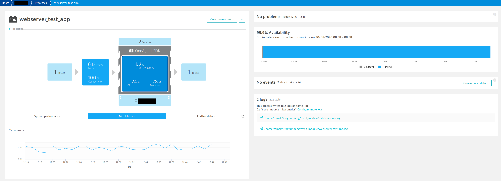
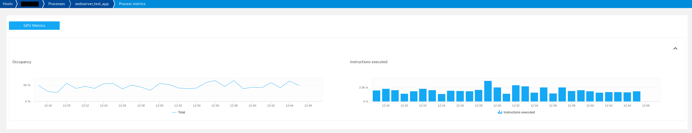

# OneAgent NVBit Extension

## Foreword

Created by [Tomasz Gajger](https://github.com/tomix86).

**Notice**: although the author is a Dynatrace employee, this is a private project. It is not maintained nor endorsed by the Dynatrace.

The project is released under the [MIT License](LICENSE).

## Overview

A [Dynatrace OneAgent](https://www.dynatrace.com/support/help/) extension for gathering NVIDIA GPU metrics using [NVIDIA Binary Instrumentation Tool (NVBit)](https://github.com/NVlabs/NVBit).

The extension consists of two parts:

* [native module](nvbit-module/README.md), which is injected into monitored applications, gathers and publishes measurements,
* [Python extension](extension/README.md) responsible for providing configuration to the native module, retrieving the metrics, aggregating them and sending to Dynatrace cluster.

All metrics are process-specific and reported per-PGI. The extension is capable of monitoring multiple GPUs, the metrics coming from all the devices will be aggregated and sent as combined timeseries.
There is no support for sending separate timeseries per device.

### Requirements

* OneAgent version >= 1.191.
* For plugin development: [OneAgent Plugin SDK v1.191 or newer](https://dynatrace.github.io/plugin-sdk/index.html).
* Python >= 3.6.
* [Compiled native module](nvbit-module/README.md).

## Configuration

See [extension README](extension/README.md#configuration).

## Reported metrics

The table below outlines metrics collected by the extension. *Figures 1* and *2* exemplify how metrics are presented on the WebUI.

| Key                               | Metric description |
|-----------------------------------|--------------------|
| gpu_occupancy                     | Average [occupancy](https://docs.nvidia.com/gameworks/index.html#developertools/desktop/analysis/report/cudaexperiments/kernellevel/achievedoccupancy.htm) achieved by kernels   |
| instructions_per_second           | Count of instuctions executed per second |

If there are multiple GPUs present, the metrics will be displayed in a joint fashion, i.e:

* `instructions_per_second` will be a sum of instructions executed on all devices,
* `gpu_occupancy` will be an average from per-device usage metrics.

...

\
_Fig 1. Host metrics reported by the extension_

\
_Fig 2. PGI metrics reported by the extension_

## Alerting

**TODO**: no alerts defined yet
